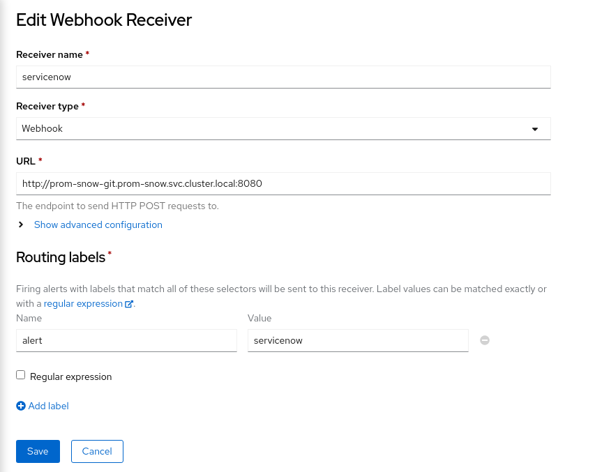

# Connecting your prometheus based alerts to an API based ITSM tool

## Overview
The article describes a mechanism to proxy non-prometheus /alert manager supported integrations to ITSM tools via the Web hook interface.

In this article today, we are going to integrate openshift based prometheus to Service now .

## Source Code and example

 The repo is [provide here for reference](https://github.com/gauravshankarcan/prom-snow) 

## Build the proxy

Lets built an proxy app using the docker image 

```
oc new-app https://github.com/gauravshankarcan/prom-snow
```
Now that the app is running , it time to direct alerts to the proxy

Let create an alert with label matchers  ```alert=servicenow```

```
apiVersion: monitoring.coreos.com/v1
kind: PrometheusRule
metadata:
  creationTimestamp: null
  labels:
    prometheus: example
    role: alert-rules
  name: prometheus-example-rules
spec:
  groups:
  - name: ./example.rules
    rules:
    - alert: ExampleAlert
      expr: vector(1)
      labels:
        alert: servicenow
```


create a receiver of type web hook



The moment alert fires next you will notice the output format in the logs of the proxy created earlier


